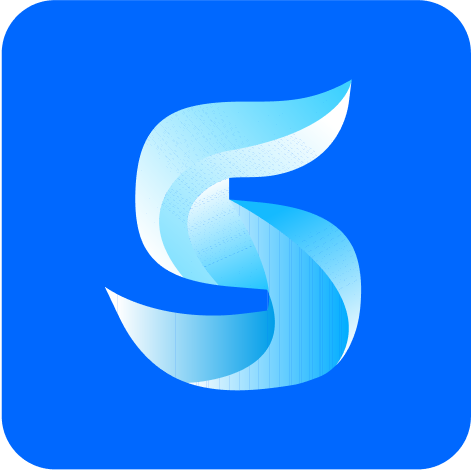

## About me
`iOS & macOS App 개발자` Heon Ha 입니다. 

실용적이고, 생활에 도움을 줄 수 있는 앱을 개발하고 있어요.

MVVM 아키텍처 및 UIKit, SwiftUI를 주 사용하여 개발하고 있습니다.

## Projects

<table>
  <thead>
    <tr>
      <th>Repo Link</th>
      <th>앱 이름</th>
      <th>한줄 설명</th>
      <th>Made by</th>
      <th>상태</th>
    </tr>
  </thead>
  <tbody>
    <tr>
      <td></td>
      <td>에브리스윔</td>
      <td>수영 기록 관리 앱</td>
      <td>UIKit + SwiftUI</td>
      <td>🛠️ 개발 중 `2023.06~`</td>
    </tr>
    <tr>
      <td></td>
      <td>9in.team</td>
      <td>프로젝트원 모집 앱</td>
      <td>SwiftUI</td>
      <td>🛠️ 개발 중 `2022.12~`</td>
    </tr>
    <tr>
      <td></td>
      <td>코젯</td>
      <td>잠금화면 위젯 메이커</td>
      <td>SwiftUI</td>
      <td>📦 출시 `v1.2.11`</td>
    </tr>
  </tbody>
</table>

로고를 누르시면 해당 Repository로 이동합니다.

---

## Links

<table>
<tr>
    <th>Title</th>
    <th>Banner</th>
</tr>
<tr>
    <td><strong>개발 블로그</strong></td>
    <td></td>
</tr>
<tr>
    <td><strong>코젯 다운로드</strong></td>
    <td></td>
</tr>
<tr>
    <td><strong>Windows 블로그</strong></td>
    <td></td>
</tr>
</table>

