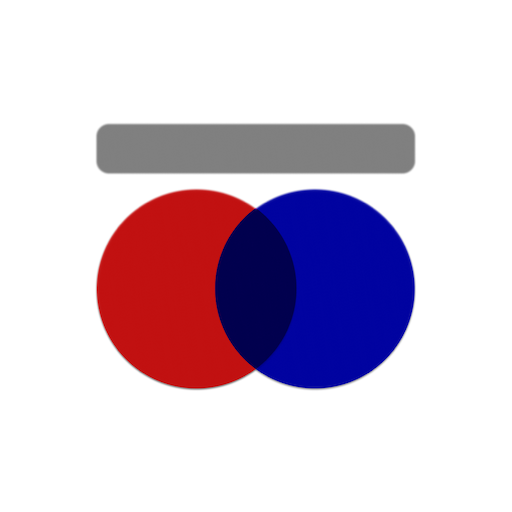
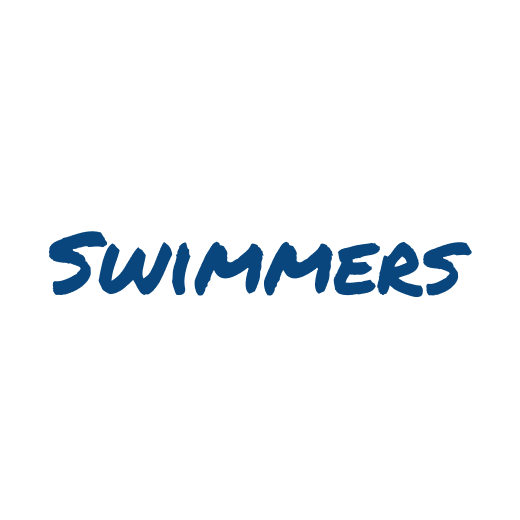

현재 작업중

    

        
        
        

    

 

My Skills

    

 

iOS Skills

<ul>
    <li>
        

            
            
            
            
        

    </li>
</ul>
 

Studying

    

 
 

 

Links

    

        
        
    

