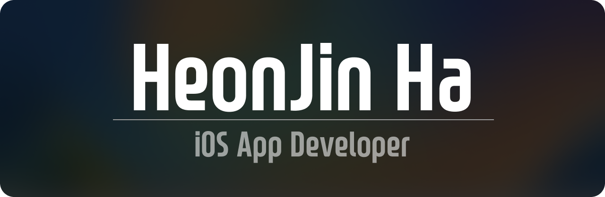

# Hi there👋, Good to see you

 

## About Me

**iOS App 개발자 하헌진 입니다.**   

I'm an iOS App Developer.

**주로 SwiftUI를 사용하고 UIKit + SnapKit 또는 Representable 을 즐겨 사용합니다.**   

I enjoy using SwiftUI and UIKit Programmatically.

**현재 Design Pattern과 RestAPI, UnitTest 공부/체화 중입니다.**   

I'm learning Design Pattern, RestAPI and UnitTest these days.

**제가 만든 코젯 앱으로 편리하게 잠금화면위젯을 생성해보세요.**   
This 'Koget' I made will save your time!

---
**블로그 / Blog**   

**코젯 다운로드**   

---
  
   
  
#### 🌳 자주, 잘 사용하는 스택

#### 🍀 활용 가능한 스택

#### 🌱 배우는 중인 것

  
